# Claude Code 项目管理

[](https://automaze.io)
 
[](https://github.com/automazeio/ccpm/blob/main/README.md)
[](https://github.com/automazeio/ccpm)
 
[](https://github.com/automazeio/ccpm/blob/main/LICENSE)
 
[](http://x.com/intent/follow?screen_name=aroussi)
 
[](https://github.com/automazeio/ccpm)

### 使用规范驱动开发、GitHub Issues、Git工作树和并行运行的多个AI代理的Claude Code工作流，以~~更快~~更好地交付项目。

停止丢失上下文。停止任务阻塞。停止交付错误。这个经过实战检验的系统将PRD转化为史诗，史诗转化为GitHub Issues，Issues转化为生产代码——每一步都有完整的可追溯性。


## 目录

- [背景](#背景)
- [工作流程](#工作流程)
- [有何不同之处？](#有何不同之处)
- [为什么使用GitHub Issues？](#为什么使用github-issues)
- [核心原则：杜绝随意编码](#核心原则杜绝随意编码)
- [系统架构](#系统架构)
- [工作流阶段](#工作流阶段)
- [命令参考](#命令参考)
- [并行执行系统](#并行执行系统)
- [主要功能与优势](#主要功能与优势)
- [已验证的结果](#已验证的结果)
- [示例流程](#示例流程)
- [立即开始](#立即开始)
- [本地与远程](#本地与远程)
- [技术说明](#技术说明)
- [支持本项目](#支持本项目)

## 背景

每个团队都面临相同的问题：
- **上下文在会话间消失**，迫使不断重新发现
- **并行工作产生冲突**，当多个开发人员接触相同代码时
- **需求漂移**，口头决策覆盖书面规范
- **进度变得不可见**，直到最后才显现

这个系统解决了所有这些问题。

## 工作流程

```mermaid
graph LR
    A[PRD创建] --> B[史诗规划]
    B --> C[任务分解]
    C --> D[GitHub同步]
    D --> E[并行执行]
```



### 观看实际操作（60秒）

```bash
# 通过引导式头脑风暴创建全面的PRD
/pm:prd-new 内存系统

# 将PRD转换为技术史诗和任务分解
/pm:prd-parse 内存系统

# 推送到GitHub并开始并行执行
/pm:epic-oneshot 内存系统
/pm:issue-start 1235
```

## 有何不同之处？

| 传统开发 | Claude Code PM 系统 |
|------------------------|----------------------|
| 会话间丢失上下文 | **持久化上下文**贯穿所有工作 |
| 串行任务执行 | **并行代理**处理独立任务 |
| 凭记忆"随意编码" | **规范驱动**，完全可追溯 |
| 进度隐藏在分支中 | **透明的审计跟踪**在GitHub中 |
| 手动任务协调 | **智能优先级排序**与`/pm:next` |

## 为什么使用GitHub Issues？

大多数Claude Code工作流在隔离环境中运行——单个开发人员在其本地环境中与AI一起工作。这产生了一个根本问题：**AI辅助开发变成了孤岛**。

通过使用GitHub Issues作为我们的数据库，我们解锁了强大的功能：

### 🤝 **真正的团队协作**
- 多个Claude实例可以同时处理同一项目
- 人类开发人员通过issue评论实时查看AI进度
- 团队成员可以随时加入——上下文始终可见
- 管理者获得透明度而不会中断工作流程

### 🔄 **无缝的人机交接**
- AI可以开始任务，人类可以完成（反之亦然）
- 进度更新对所有人可见，不会被困在聊天记录中
- 代码审查通过PR评论自然进行
- 没有"AI做了什么？"的会议

### 📈 **超越单人工作的可扩展性**
- 添加团队成员而无须繁琐的入职流程
- 多个AI代理并行处理不同issues
- 分布式团队自动保持同步
- 与现有的GitHub工作流和工具配合使用

### 🎯 **单一事实来源**
- 无需单独的数据库或项目管理工具
- Issue状态就是项目状态
- 评论就是审计跟踪
- 标签提供组织功能

这不仅仅是一个项目管理系统——它是一个**协作协议**，让人类和AI代理能够大规模协作，使用您的团队已经信任的基础设施。

## 核心原则：杜绝随意编码

> **每一行代码都必须追溯到规范。**

我们遵循严格的5阶段准则：

1. **🧠 头脑风暴** - 比舒适区思考得更深入
2. **📝 文档化** - 编写不留任何解释空间的规范
3. **📐 规划** - 制定明确技术决策的架构
4. **⚡ 执行** - 精确构建规范内容
5. **📊 跟踪** - 在每个步骤保持透明的进度

没有捷径。没有假设。没有遗憾。

## 系统架构

```
.claude/
├── CLAUDE.md          # 始终有效的指令（将内容复制到项目的CLAUDE.md文件）
├── agents/            # 面向任务的代理（用于上下文保存）
├── commands/          # 命令定义
│   ├── context/       # 创建、更新和准备上下文
│   ├── pm/            # ← 项目管理命令（本系统）
│   └── testing/       # 准备和执行测试（编辑此内容）
├── context/           # 项目范围的上下文文件
├── epics/             # ← PM的本地工作空间（放在.gitignore中）
│   └── [epic-name]/   # 史诗和相关任务
│       ├── epic.md    # 实施计划
│       ├── [#].md     # 单个任务文件
│       └── updates/   # 进行中的更新
├── prds/              # ← PM的PRD文件
├── rules/             # 放置任何想要引用的规则文件
└── scripts/           # 放置任何想要使用的脚本文件
```

## 工作流阶段

### 1. 产品规划阶段

```bash
/pm:prd-new 功能名称
```
启动全面的头脑风暴，创建产品需求文档，捕捉愿景、用户故事、成功标准和约束。

**输出：** `.claude/prds/功能名称.md`

### 2. 实施规划阶段

```bash
/pm:prd-parse 功能名称
```
将PRD转换为技术实施计划，包括架构决策、技术方法和依赖关系映射。

**输出：** `.claude/epics/功能名称/epic.md`

### 3. 任务分解阶段

```bash
/pm:epic-decompose 功能名称
```
将史诗分解为具体的、可操作的任务，包括验收标准、工作量估算和并行化标志。

**输出：** `.claude/epics/功能名称/[任务].md`

### 4. GitHub同步

```bash
/pm:epic-sync 功能名称
# 或者对于自信的工作流：
/pm:epic-oneshot 功能名称
```
将史诗和任务推送到GitHub作为issues，带有适当的标签和关系。

### 5. 执行阶段

```bash
/pm:issue-start 1234  # 启动 specialized agent
/pm:issue-sync 1234   # 推送进度更新
/pm:next             # 获取下一个优先级任务
```
Specialized agents实施任务，同时维护进度更新和审计跟踪。

## 命令参考

> [!TIP]
> 输入 `/pm:help` 获取简洁的命令摘要

### 初始设置
- `/pm:init` - 安装依赖项并配置GitHub

### PRD命令
- `/pm:prd-new` - 启动新产品需求的头脑风暴
- `/pm:prd-parse` - 将PRD转换为实施史诗
- `/pm:prd-list` - 列出所有PRD
- `/pm:prd-edit` - 编辑现有PRD
- `/pm:prd-status` - 显示PRD实施状态

### 史诗命令
- `/pm:epic-decompose` - 将史诗分解为任务文件
- `/pm:epic-sync` - 将史诗和任务推送到GitHub
- `/pm:epic-oneshot` - 一次性分解和同步
- `/pm:epic-list` - 列出所有史诗
- `/pm:epic-show` - 显示史诗及其任务
- `/pm:epic-close` - 标记史诗为完成
- `/pm:epic-edit` - 编辑史诗详情
- `/pm:epic-refresh` - 从任务更新史诗进度

### Issue命令
- `/pm:issue-show` - 显示issue和子issues
- `/pm:issue-status` - 检查issue状态
- `/pm:issue-start` - 使用specialized agent开始工作
- `/pm:issue-sync` - 推送更新到GitHub
- `/pm:issue-close` - 标记issue为完成
- `/pm:issue-reopen` - 重新打开已关闭的issue
- `/pm:issue-edit` - 编辑issue详情

### 工作流命令
- `/pm:next` - 显示下一个优先级issue及其史诗上下文
- `/pm:status` - 整体项目仪表板
- `/pm:standup` - 每日站会报告
- `/pm:blocked` - 显示被阻塞的任务
- `/pm:in-progress` - 列出进行中的工作

### 同步命令
- `/pm:sync` - 与GitHub进行完整的双向同步
- `/pm:import` - 导入现有的GitHub issues

### 维护命令
- `/pm:validate` - 检查系统完整性
- `/pm:clean` - 归档已完成的工作
- `/pm:search` - 跨所有内容搜索

## 并行执行系统

### Issues不是原子性的

传统思维：一个issue = 一个开发人员 = 一个任务

**现实：一个issue = 多个并行工作流**

单个"实施用户认证"issue不是一个任务。它是...

- **代理1**: 数据库表和迁移
- **代理2**: 服务层和业务逻辑
- **代理3**: API端点和中间件
- **代理4**: UI组件和表单
- **代理5**: 测试套件和文档

所有在同一个工作树中**同时**运行。

### 速度的数学

**传统方法：**
- 包含3个issues的史诗
- 顺序执行

**本系统：**
- 相同的包含3个issues的史诗
- 每个issue分成约4个并行流
- **12个代理同时工作**

我们不是将代理分配给issues。我们正在**利用多个代理**来更快地交付。

### 上下文优化

**传统的单线程方法：**
- 主对话携带所有实施细节
- 上下文窗口填满数据库模式、API代码、UI组件
- 最终达到上下文限制并失去连贯性

**并行代理方法：**
- 主线程保持清洁和战略性
- 每个代理在隔离中处理自己的上下文
- 实施细节永远不会污染主对话
- 主线程保持监督而不会被代码淹没

您的主对话成为指挥，而不是乐团。

### GitHub vs 本地：完美分离

**GitHub看到的内容：**
- 清洁、简单的issues
- 进度更新
- 完成状态

**本地实际发生的内容：**
- Issue #1234爆炸成5个并行代理
- 代理通过Git提交协调
- 复杂的编排对视图隐藏

GitHub不需要知道工作是如何完成的——只需要知道它已经完成。

### 命令流程

```bash
# 分析可以并行化的内容
/pm:issue-analyze 1234

# 启动集群
/pm:epic-start 内存系统

# 观看魔法发生
# 12个代理跨3个issues工作
# 全部在：../epic-memory-system/

# 完成后进行一次清洁合并
/pm:epic-merge 内存系统
```

## 主要功能与优势

### 🧠 **上下文保存**
再也不会丢失项目状态。每个史诗维护自己的上下文，代理从`.claude/context/`读取，并在同步前本地更新。

### ⚡ **并行执行**
通过多个代理同时工作来更快交付。标记为`parallel: true`的任务启用无冲突的并发开发。

### 🔗 **GitHub原生**
与您的团队已经使用的工具配合使用。Issues是事实来源，评论提供历史记录，并且不依赖Projects API。

### 🤖 **代理专业化**
每个工作都有合适的工具。不同的代理处理UI、API和数据库工作。每个都读取需求并自动发布更新。

### 📊 **完全可追溯性**
每个决策都有文档记录。PRD → 史诗 → 任务 → Issue → 代码 → 提交。从想法到生产的完整审计跟踪。

### 🚀 **开发人员生产力**
专注于构建，而不是管理。智能优先级排序、自动上下文加载和准备就绪时的增量同步。

## 已验证的结果

使用此系统的团队报告：
- **减少89%的时间**因上下文切换而丢失——您将大量使用`/compact`和`/clear`
- **5-8个并行任务** vs 以前的1个——同时编辑/测试多个文件
- **减少75%的错误率**——由于将功能分解为详细任务
- **功能交付速度提高3倍**——基于功能大小和复杂性

## 示例流程

```bash
# 启动新功能
/pm:prd-new 内存系统

# 审查和完善PRD...

# 创建实施计划
/pm:prd-parse 内存系统

# 审查史诗...

# 分解为任务并推送到GitHub
/pm:epic-oneshot 内存系统
# 创建issues: #1234 (史诗), #1235, #1236 (任务)

# 在任务上开始开发
/pm:issue-start 1235
# 代理开始工作，维护本地进度

# 同步进度到GitHub
/pm:issue-sync 1235
# 更新作为issue评论发布

# 检查整体状态
/pm:epic-show 内存系统
```

## 立即开始

### 快速设置（2分钟）

1. **将此仓库安装到您的项目中**：

   #### Unix/Linux/macOS

   ```bash
   cd 路径/到/您的/项目/
   curl -sSL https://raw.githubusercontent.com/automazeio/ccpm/main/ccpm.sh | bash
   # 或: wget -qO- https://raw.githubusercontent.com/automazeio/ccpm/main/ccpm.sh | bash
   ```

   #### Windows (PowerShell)
   ```bash
   cd 路径/到/您的/项目/
   iwr -useb https://raw.githubusercontent.com/automazeio/ccpm/main/ccpm.bat | iex
   ```
   > ⚠️ **重要**: 如果您已经有`.claude`目录，请将此仓库克隆到不同目录，并将克隆的`.claude`目录内容复制到您项目的`.claude`目录。

   查看完整/其他安装选项在[安装指南 ›](https://github.com/automazeio/ccpm/tree/main/install)


2. **初始化PM系统**：
   ```bash
   /pm:init
   ```
   此命令将：
   - 安装GitHub CLI（如果需要）
   - 使用GitHub认证
   - 安装[gh-sub-issue扩展](https://github.com/yahsan2/gh-sub-issue)以正确处理父子关系
   - 创建所需目录
   - 更新.gitignore

3. **创建`CLAUDE.md`**并包含您的仓库信息
   ```bash
   /init include rules from .claude/CLAUDE.md
   ```
   > 如果您已经有`CLAUDE.md`文件，请运行：`/re-init`以使用`.claude/CLAUDE.md`中的重要规则更新它。

4. **准备系统**：
   ```bash
   /context:create
   ```


### 启动您的第一个功能

```bash
/pm:prd-new 您的功能名称
```

观看结构化规划如何转化为交付的代码。

## 本地与远程

| 操作 | 本地 | GitHub |
|-----------|-------|--------|
| PRD创建 | ✅ | — |
| 实施规划 | ✅ | — |
| 任务分解 | ✅ | ✅ (同步) |
| 执行 | ✅ | — |
| 状态更新 | ✅ | ✅ (同步) |
| 最终交付物 | — | ✅ |

## 技术说明

### GitHub集成
- 使用**gh-sub-issue扩展**正确处理父子关系
- 如果未安装扩展则回退到任务列表
- 史诗issues自动跟踪子任务完成情况
- 标签提供额外组织功能（`epic:feature`, `task:feature`）

### 文件命名约定
- 任务开始时为`001.md`, `002.md`在分解期间
- GitHub同步后，重命名为`{issue-id}.md`（例如`1234.md`）
- 易于导航：issue #1234 = 文件`1234.md`

### 设计决策
- 有意避免GitHub Projects API复杂性
- 所有命令首先在本地文件上操作以提高速度
- 与GitHub的同步是显式和受控的
- 工作树为并行工作提供清洁的git隔离
- GitHub Projects可以单独添加用于可视化

---

## 支持本项目

Claude Code PM在[Automaze](https://automaze.io)开发，**为交付的开发人员，由交付的开发人员开发**。

如果Claude Code PM帮助您的团队交付更好的软件：

- ⭐ **[给此仓库加星](https://github.com/automazeio/ccpm)**以示支持
- 🐦 **[在X上关注@aroussi](https://x.com/aroussi)**获取更新和提示


---

> [!TIP]
> **与Automaze一起更快交付。**我们与创始人合作，将他们的愿景变为现实，扩展他们的业务，并优化成功。
> **[访问Automaze与我预约通话 ›](https://automaze.io)**

---

## 星标历史


